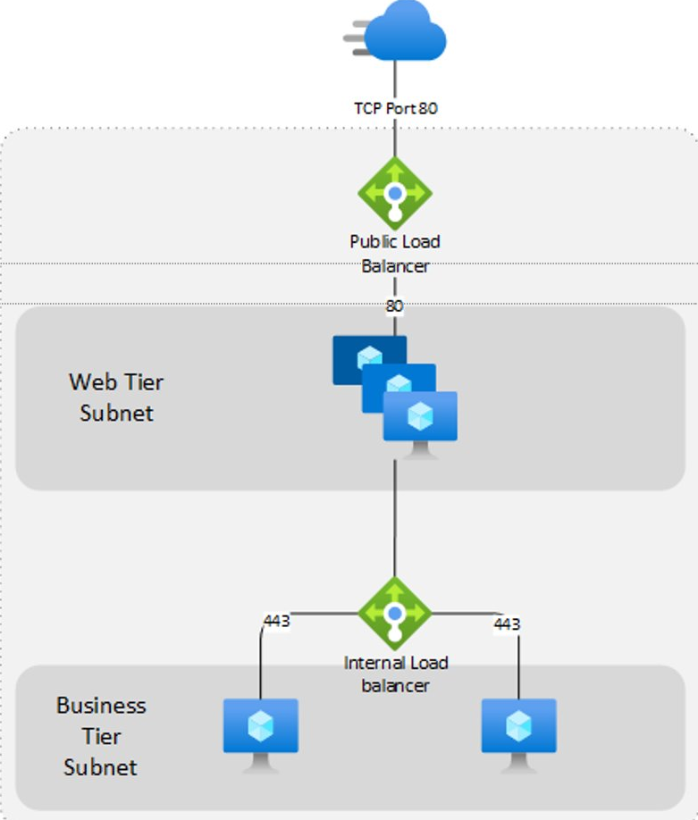

About
===

This repository is used to showcase a proof of concept for IaC usage within an Azure tenant.

I personally use this to demonstrate how to deploy a simple load balanced application to azure utilizing services such as:

* Networking
* Load balancing
* Virtual machine scale sets
* Azure DNS
* Taggning
* Imaging

Used for demo purposes only!

Tools
===

The following tools are showcased:

* Packer
* Terraform
* Azure DevOps

Reference Architecture
===

